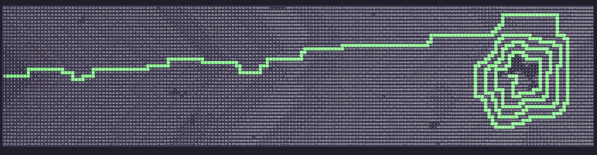

# Advent of Code

This is my solutions to the [Advent of Code](http://adventofcode.com/) puzzles. I have used C# and TDD to solve
the puzzles.

# Demo

## 2022 - Day 14 - Demo

Here is an example of the solution for day 14. I created an animation of the sand falling into the cave in the
terminal. For part 1 I show each sand added, for part 2 I show every 1009 sand added to the cave.


You can find the description here: [2022 / Day 14 / Description](./2022/AdventOfCode.2022.Day14/Description.md)

### How to run the 2022 - Day 14 application

open a terminal and run the following commands:

```bash
cd 2022\AdventOfCode.2022.Day14
dotnet run
```

## 2022 - Day 12 - Demo

Poorly implemented path finding algorithm. It will find the shortest path between two points, but it will not do it very fast... 
Made a nice animation of the path finding algorithm though.


much better implementation of the path finding algorithm. Prioritizes the path that is closest to the goal.


Result



## 2022 - Day 5 - Demo

Here is an example of the solution for day 5. It will print out all the move operations and the results along
the way.

I have written an in-depth description of the solution here:
https://medium.com/systek/test-drevet-adventskalender-c12ee26909eb (Norwegian)


You can find the description here: [2022 / Day 5 / Description](./2022/AdventOfCode.2022.Day5/Description.md)

### How to run the 2022 - Day 5 application

open a terminal and run the following commands:

```bash
cd 2022\AdventOfCode.2022.Day5
dotnet run
```

